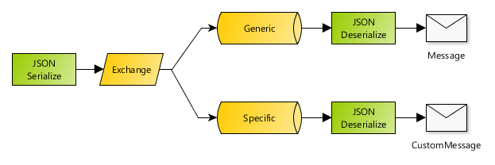

# Spring Boot AMQP messaging example with RabbitMQ

This is a simple Spring Boot app that shows how to easily configure RabbitMQ with AMQP for producing and consuming messages
in default format (java serialized) and JSON.

In this sample project, each message is sent as JSON and then decoded:

1. on a queue as a generic `Message` object,
2. and on a different queue as the original specific class (with JSON deserialization).

